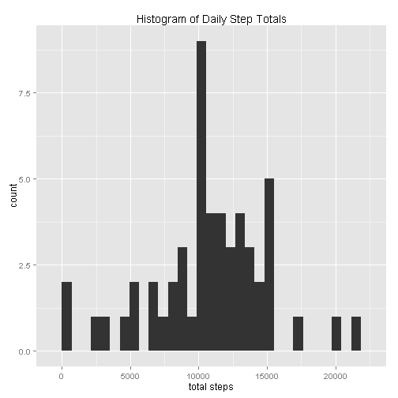
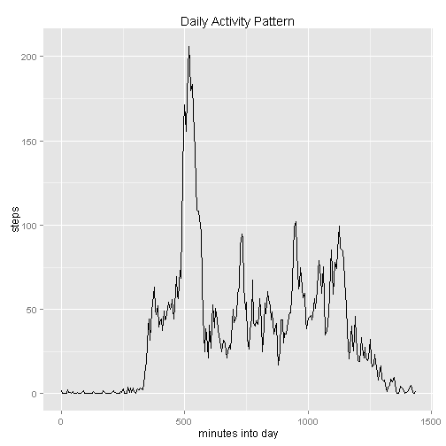
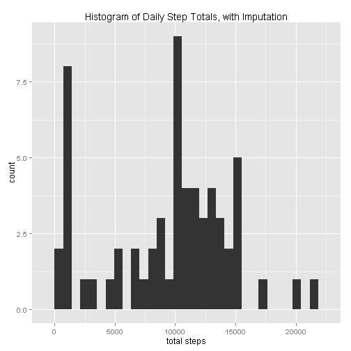
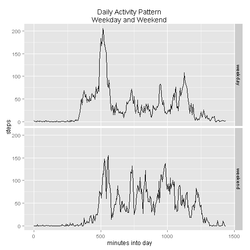

This is an R Markdown document. Markdown is a simple formatting syntax for authoring HTML, PDF, and MS Word documents. For more details on using R Markdown see <http://rmarkdown.rstudio.com>.


## Goal: Reproducible Analysis of the repdata-data-activity/activity.csv File


### Load the packages that will be used.


```r
library(knitr)
require(plyr)
require(ggplot2)
require(hash)
```

### Loading and preprocessing the data


```r
dat<-read.csv("repdata-data-activity/activity.csv")
dat$date<-strptime(dat$date,"%Y-%m-%d") # convert character to date
dat$fivemin<-dat$interval%%100+60*dat$interval%/%100 # make equally-spaced time labels
```

### What is mean total number of steps taken per day?

#### Calculate the total number of steps taken per day.

Ignore missing values, dropping days with all values missing.


```r
dat_complete<-dat[!is.na(dat$steps),]
dat_by_day<-ddply(dat_complete,.(date),summarize,stepsum=sum(steps))
```

#### Make a histogram.


```r
qplot(stepsum,data=dat_by_day)+labs(title="Histogram of Daily Step Totals",
  x="total steps")
```

 

#### Calculate and report the mean and median of the total number of steps taken per day.


```r
mean(dat_by_day$stepsum)
```

```
## [1] 10766.19
```

```r
median(dat_by_day$stepsum)
```

```
## [1] 10765
```

### What is the average daily activity pattern?

#### Make a time series plot (i.e. type = "l") of the 5-minute interval (x-axis) and the average number of steps taken, averaged across all days (y-axis)

To arrange for the intervals to be appropriately spaced, use the fivemin variable, which gives the starting minute of the interval.


```r
dat_by_minute<-ddply(dat_complete,.(fivemin),summarize,steps=mean(steps))
qplot(fivemin,steps,data=dat_by_minute,geom="line")+
  labs(title="Daily Activity Pattern",x="minutes into day")
```

 

#### Which 5-minute interval, on average across all the days in the dataset, contains the maximum number of steps?
max_interval gives the interval with the maximum mean number of steps.


```r
max_index<-which(dat_by_minute$steps==max(dat_by_minute$steps))
max_fivemin<-dat_by_minute$fivemin[max_index]
max_interval<-dat$interval[which(dat$fivemin==max_fivemin)][1]
max_interval
```

```
## [1] 835
```


### Imputing missing values

#### Calculate and report the total number of missing values in the data


```r
sum(!complete.cases(dat[,c(1,3)]))
```

```
## [1] 2304
```

#### Devise a strategy for filling in all of the missing values in the dataset. 

Here, we will use the median of the non-missing values for that interval to replace any NA's in the interval.

#### Create a new dataset that is equal to the original dataset but with the missing data filled in.


```r
dat_interval<-dat_complete
dat_interval<-ddply(dat_interval,.(interval),summarize,
  stepmedian=median(steps))
assign_steps<-hash(dat_interval$interval,dat_interval$stepmedian) # create a hash to associate
        # the interval with median number of steps in the interval.
dat_impute<-dat # create a new data frame for the original and imputed data
bad<-is.na(dat_impute$steps)
dat_impute$steps[bad]<-
	values(assign_steps,as.character(dat_impute$interval[bad]))
```

#### Make a histogram of the total number of steps taken each day and Calculate and report the mean and median total number of steps taken per day.


```r
dat_i_by_day<-ddply(dat_impute,.(date),summarize,stepsum=sum(steps))
 ## make a histogram
qplot(stepsum,data=dat_i_by_day)+
  labs(title="Histogram of Daily Step Totals, with Imputation",
	x="total steps")
```

 

```r
 ## Calculate and report the mean and median of the total number of steps 
 ## taken per day
mean(dat_i_by_day$stepsum)
```

```
## [1] 9503.869
```

```r
median(dat_i_by_day$stepsum)
```

```
## [1] 10395
```

#### Do these values differ from the estimates from the first part of the assignment? What is the impact of imputing missing data on the estimates of the total daily number of steps?

These values are different. We see an increase in low numbers of steps. 

### Are there differences in activity patterns between weekdays and weekends?


#### Create a new factor variable in the dataset with two levels - "weekday" and "weekend" indicating whether a given date is a weekday or weekend day.


```r
dat_impute$type<-"weekday"
weekend<-weekdays(dat_impute$date) %in% c("Saturday","Sunday")
dat_impute$type[weekend]<-"weekend"
```

#### Make a panel plot containing a time series plot (i.e. type = "l") of the 5-minute interval (x-axis) and the average number of steps taken, averaged across all weekday days or weekend days (y-axis).


```r
dat_i_by_minute<-ddply(dat_impute,.(fivemin,type),summarize,steps=mean(steps))
qplot(fivemin,steps,data=dat_i_by_minute,facets=type~.,geom="line")+
  labs(title="Daily Activity Pattern\nWeekday and Weekend",x="minutes into day")
```

 

